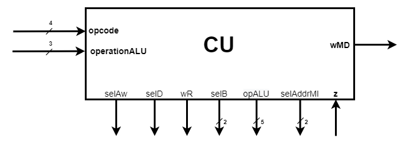
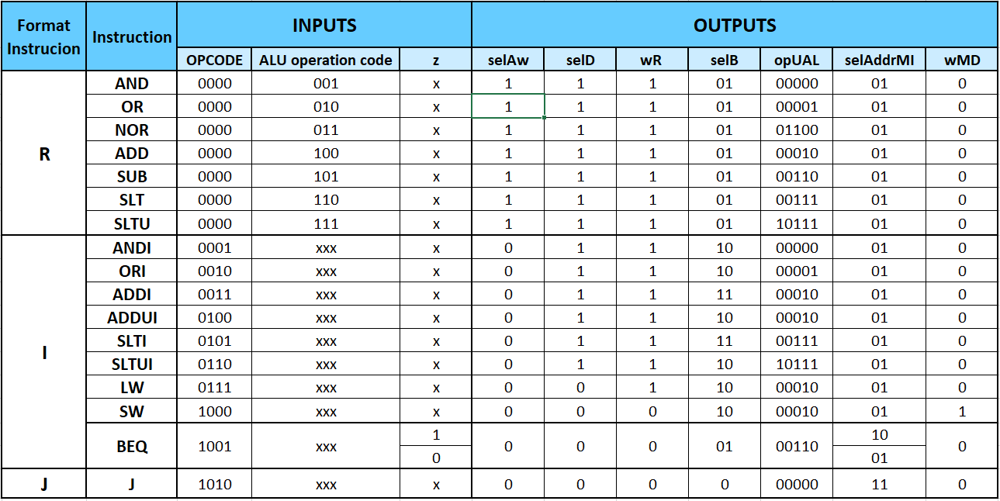

# Control Unit (CU)
---
CU is the processor block responsible for generating signals that control the behaviour of [Data Unit](../DU) (DU). 
It is represented in the figure below.

  

  
The pins of this unit and their meaning are as follows:  
* `opcode[3:0]` = input pin that receives information about the elementary operation to be performed by DU;  
* `operationALU[2:0]` = input pin that receives information that is required for R-format instructions by DU;  
* `z` = output pin that provides a signal indicating a result equal to 0 at the output of [Arithmetic-Logic Unit](../DU/EB/ALU) (ALU);  
* `selAw` = output pin that provides a control signal that selects from the current instruction word the address of the internal register where the data will be written;  
* `selD` = output pin that provides a control signal that selects the source of the data to be stored in the internal register;  
* `wR` = output pin that provides a control signal that commands the writing of data to the internal register;
* `selB[1:0]` = output pin that provides a control signal that selects the source of the second operand (B) used in ALU;
* `opUAL[4:0]` = output pin that provides a control signal that selects the type of elementary operation performed by ALU;  
* `selAddrMI[1:0]` = output pin that provides a control signal that selects the type of the next instruction address;  
* `wMD` = output pin that provides a control signal that commands the writing of data to Memory Data.
  
	
### Architecture
  
CU is implemented using a decoder, which receives the input signals and provides the control signals for DU. The decoder truth table is shown below.

  

  