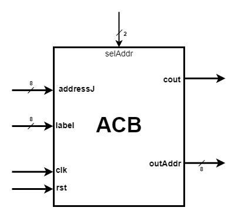
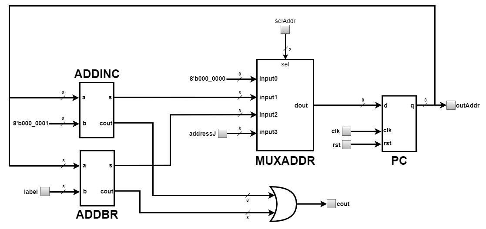

# Address Calculation Block (ACB)
---
ACB is the processor block which calculates the value of the address of the next instruction based on the address and type of the current 
instruction. Details on how to calculate the address of the next instruction are presented in [Architecture](#architecture) section.  
The address of the current instruction is provided by a special register called Program Counter (PC). The value of the address delivered to 
Instruction Memory Block can be between 0 and 255, this means that the code executed by the processor can have a maximum of 256 instructions. This 
maximum number of instructions is valid if the size of the instruction word in the memory is 16 bits.  
ACB is represented in the figure below.  

  

  
The pins of this unit and their meaning are as follows:  
* `rst` = input pin that receives the asynchronous initialization signal, which is active high;   
* `clk` = input pin that receives the clock signal, the active front is the positive one;    
* `label[7:0]` = input pin that receives the value of the label required by BEQ conditional branch instruction;   
* `addressJ[7:0]` = input pin that receives the value of the jump address; although J-type instruction uses 12 bits to specify the jump address, due to the fact that the output of the current block is 8 bits, only bits [7: 0] of that address will be considered;  
* `selAddr[1:0]` = input pin that receives a control signal from CU that selects the type of the next instruction address;   
* `cout` = output pin that provides a signal that indicates an overflow of the addressing capacity of Instruction Memory Block;  
* `outAddr[7:0]` = output pin that provides the address of the next instruction;  
  
  
### Architecture
  
ACB consits of ADDINC, ADDBR, MUXADDR, PC and an OR gate. ADDINC is an adder that calculates the address of the next instruction by adding 1 to 
the current address of the instruction. ADDBR is also an adder, but its role is to calculate the address of the next instruction by adding a value 
equal to the `label` to the current address of the instruction when BEQ instruction is executed. MUXADDR is a multiplexer that has the role to choose the 
address of the next instruction. It can choose between the outputs of the 2 adders, address 0 or jump address (`addressJ`).  

  

