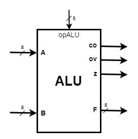
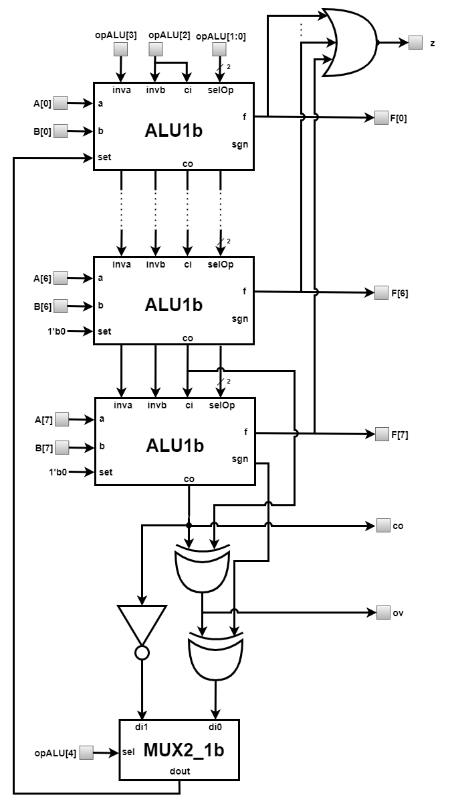
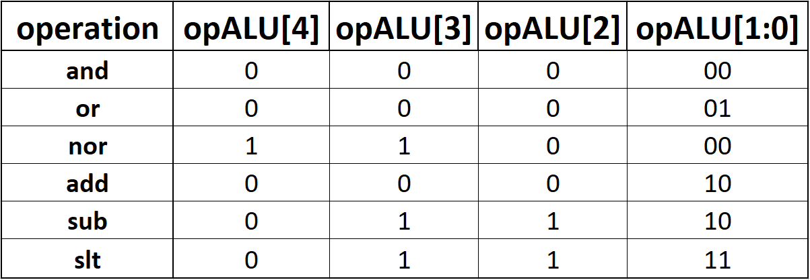
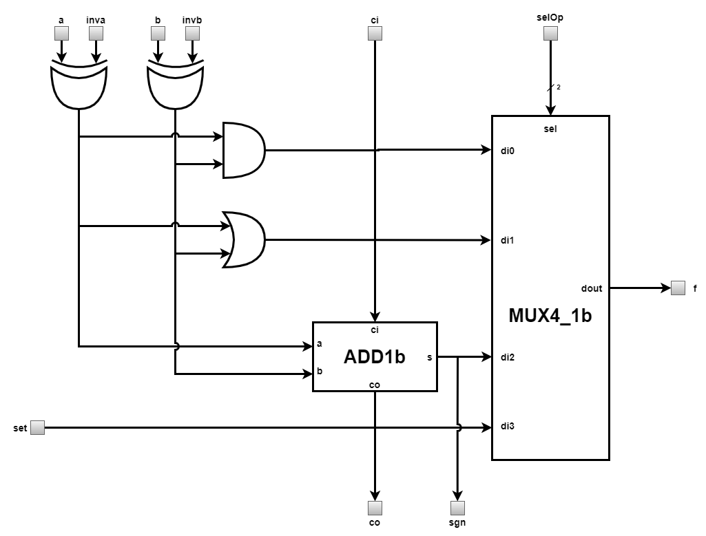

# Arithmetic-Logic Unit (ALU)
---
ALU is the block that performs the most basic 8-bit operations of the processor. It takes over the operands and performs the operation indicated by the 
[Control Unit](../../../CU). ALU is represented in the figure below.  

  

  
The pins of this unit and their meaning are as follows:  
* `A[7:0]` = input pin that receives the first operand;  
* `B[7:0]` = input pin that receives the second operand;  
* `opALU[4:0]` = input pin that receives a signal that selects the type of elementary operation performed by ALU;  
* `F[7:0]` = output pin that provides the result of the operation performed by ALU;  
* `ov(overflow)` = output pin that provides a signal that indicates an overflow in the representation of the result of an operation between signed integers;  
* `co(carry output)` = output pin that provides a signal that indicates an overflow in the representation of the result of an operation between unsigned integers;  
* `z` = output pin that provides a signal indicating a result equal to 0 at the output of ALU;  

### Architecture
  

  

  
As it can be seen from the figure above, the essential block of ALU is the 1-bit arithmetic-logic unit. Connecting 8 blocks of this type with a multiplexer and a few 
logic gates you get a block capable of performing the desired operations. Operations can be selected using `opALU` pin. Depending on its value, one operation or another 
is selected. The table below shows the values ​​that `opALU` must have in order to select the desired operation. 

  

  
The architecure of the 1-bit ALU is shown in figure below. The subtraction operation is implemented as a sum of the operands. This is possible because the subtractor 
is represented in **complement to 2** (C2). C2 is implemented using XOR gates. So `a - b = a +!b + ci`, where `ci` is equal to 1. At ALU level, the subtraction operation follows 
the following formula `A - B = A + !B + 1`. In this case, only the first 1-bit arithmetic-logic unit will have `ci = 1`, the rest of the blocks will have on the input ci the value 
provided by the pin `co` of the previous block.  

  

