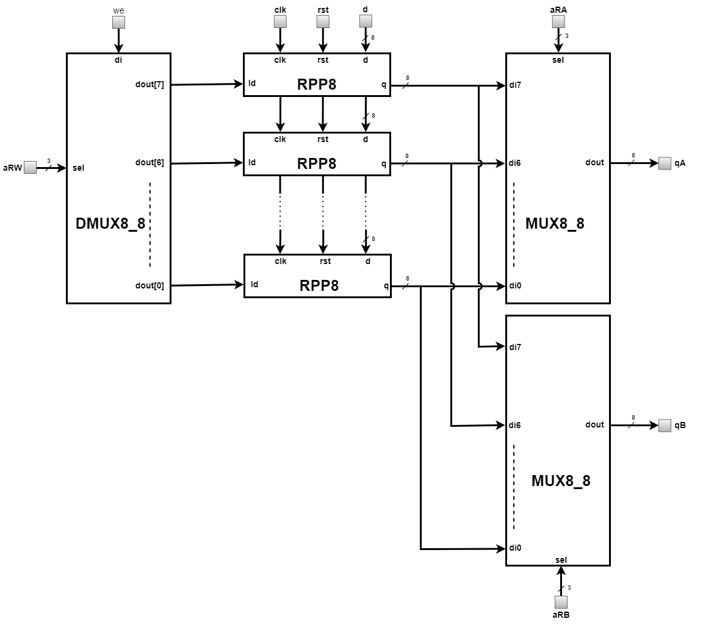

# Internal Registers File (IRF)
---
IRF is the block that temporarily stores data in the processor. In the data processing and decision instructions (BEQ), the role of this circuit is to provide 
the values ​​of the operands to the inputs of the Arithmetic-Logic Unit, as well as to store the result generated at its output. In the data transfer instructions between 
the processor and the Data Memory Block (LW and SW), the role of this circuit is to provide the data to be saved in the memory, respectively to store the data loaded from 
the memory. IRF is represented in the figure below.   

  

   
The pins of this unit and their meaning are as follows: 
* `rst` = input pin that receives the asynchronous initialization signal, which is active high;  
* `clk` = input pin that receives the clock signal, the active front is the positive one;   
* `d[7:0]` = input pin that receives the data which will be written to the internal register from the `aRW` address;  
* `aRW[2:0]` = input pin that receives the internal register address where the data will be written, when the write operation is performed;    
* `aRA[2:0]` = input pin that receives the internal register address from which the content will be read and provided to the output pin `qA`, when a read operation is performed;    
* `aRB[2:0]` = input pin that receives the internal register address from which the content will be read and provided to the output pin `qB`, when a read operation is performed;  
* `we` = input pin that receives a signal that commands the writing of data to the internal register;  
* `qA[7:0]` = output pin that provides the read contents of the internal register from the "aRA" address when performing a read operation;    
* `qB[7:0]` = output pin that provides the read contents of the internal register from the "aRB" address when performing a read operation;    

### Architecture
  
IRF consits of DMUX8_8, 2 blocks of MUX8_8 and 8 blocks of RPP8. DMUX8_8 is a demultiplexer that selects the internal register where the data will be written, when performing 
the write operation. MUX8_8 is a multiplexer that is used to select the internal register from where the data will be read, when performing the read operation. RPP8 is a register 
with 8-bit parallel input and output.   

  

