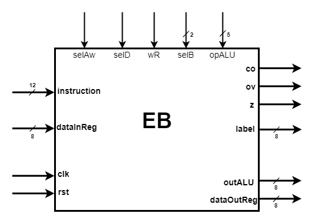
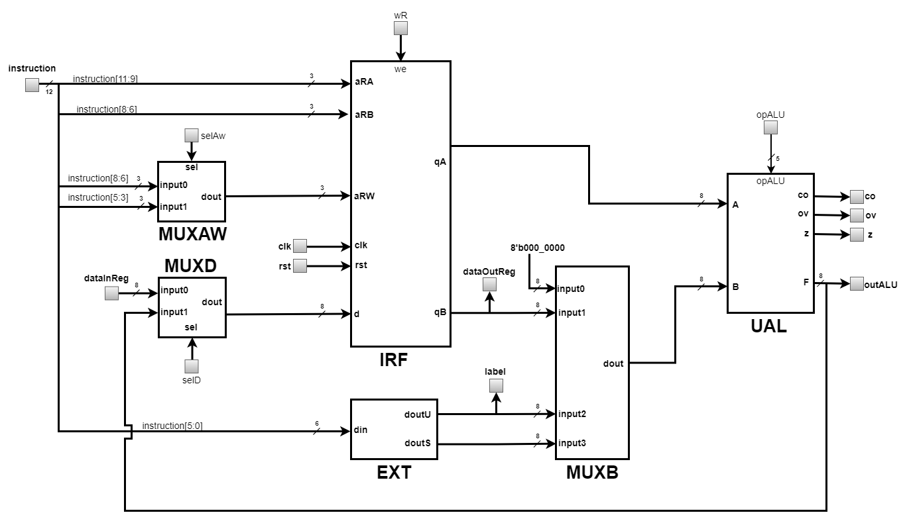

# Execution Block (EB)
---
EB performs the basic operations specific to the R and I format instructions defined in the processor instruction set. It performs arithmetic-logic operations 
and memory location address calculation. J instruction is executed in [Address Calculation Block](../ACB) (ACB). EB is represented in the figure below.  

  

   
The pins of this unit and their meaning are as follows:  
* `rst` = input pin that receives the asynchronous initialization signal, which is active high;  
* `clk` = input pin that receives the clock signal, the active front is the positive one;   
* `dataInReg[7:0]` = input pin that receives the data read from Data Memory Block as a result of using LW instruction;  
* `instrucion[11:0]` = input pin that receives source and destination registers (rs, rt, rd) and immediate value (value, offset, label);   
* `selAw` = input pin that receives the address of the internal register where the data will be written;  
* `selD` = input pin that receives a signal that selects the source of the data to be stored in the internal register;  
* `wR` = input pin that receives a signal that commands the writing of data to the internal register;
* `selB[1:0]` = input pin that receives a signal that selects the source of the second operand (B) used in [Arithmetic-Logic Unit](ALU) (ALU);
* `opALU[4:0]` = input pin that receives a signal that selects the type of elementary operation performed by ALU;  
* `z` = output pin that provides a signal indicating a result equal to 0 at the output of ALU;  
* `co` = output pin that provides a signal that indicates an overflow in the representation of the result of an operation between unsigned integers;  
* `ov` = output pin that provides a signal that indicates an overflow in the representation of the result of an operation between signed integers;  
* `label[7:0]` = output pin that provides the value of the label required by ACB to calculate the address of the next instruction when is executed BEQ conditional branch instruction;  
* `dataOutReg[7:0]` = output pin that provides the data to be written to Data Memory Block as a result of using SW instruction;  
* `outALU[7:0]` = output pin that provides the data address which will be written/read to/from Data Memory Block;  
  
  
### Architecture
  
EB consits of MUXAW, MUXD, [IRF](IRF), EXT, MUXB and ALU. MUXAW is a multiplexer that selects the address of the internal register where the data will be written. MUXD 
is a multiplexer which selects the source of the data to be stored in the internal register. IRF is the block that temporarily stores data in the processor. It contains 
all the internal registers of the processor. EXT is an extension block that takes the immediate value on 6 bits and expands it to 8 bits in signed and unsigned formats. MUXB 
is a multiplexer which selects the source of the second operand (B) used in  ALU. ALU is the block that performs the most basic operations of the processor. 

  

