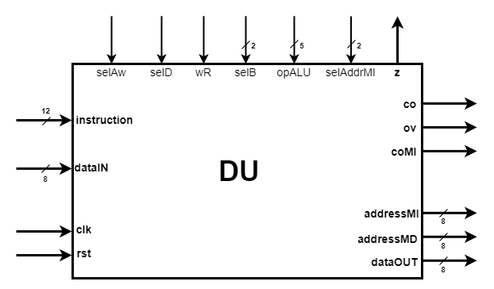
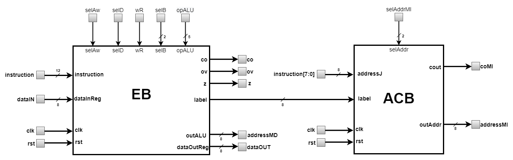

# Data Unit (DU)
---
DU is the processor block responsible for performing the elementary operations specific to the instructions and calculating 
the address of the next instruction. It is represented in the figure below.  

  

  
The pins of this unit and their meaning are as follows:  
* `rst` = input pin that receives the asynchronous initialization signal, which is active high;  
* `clk` = input pin that receives the clock signal, the active front is the positive one;   
* `dataIN[7:0]` = pin that receives the data read from Data Memory Block as a result of using LW instruction;  
* `instrucion[11:0]` = pin that receives part of the machine code from the current instruction;  
* `selAw` = pin that receives a control signal from CU that selects from the current instruction word the address of the internal register where the data will be written;  
* `selD` = pin that receives a control signal from CU that selects the source of the data to be stored in the internal register;  
* `wR` = pin that receives a control signal from CU that commands the writing of data to the internal register;
* `selB[1:0]` = input pin that receives a control signal from CU that selects the source of the second operand (B) used in [Arithmetic-Logic Unit](EB/ALU) (ALU);
* `opALU[4:0]` = input pin that receives a control signal from CU that selects the type of elementary operation performed by ALU;  
* `selAddrMI[1:0]` = input pin that receives a control signal from CU that selects the type of the next instruction address;  
* `z` = output pin that provides a signal indicating a result equal to 0 at the output of ALU;  
* `co` = output pin that provides a signal that indicates an overflow in the representation of the result of an operation between unsigned integers;  
* `ov` = output pin that provides a signal that indicates an overflow in the representation of the result of an operation between signed integers;  
* `coMI` = output pin that provides a signal that indicates an overflow of the addressing capacity of Instruction Memory Block;  
* `addressMI[7:0]` = output pin that provides the address of the next instruction;  
* `addressMD[7:0]` = output pin that provides the required address of Data Memory Block to perfom read/write operation;   
* `dataOUT[7:0]` = output pin that provides the data to be written to Data Memory Block as a result of using SW instruction;  

### Architecture
  
DU consists of the [**Execution Block**](EB) (EB) and the [**Address Calculation Block**](ACB) (ACB). EB performs the basic operations specific to the current instruction and 
ACB calculates the value of the address of the next instruction based on the address and type of the current instruction.

  

