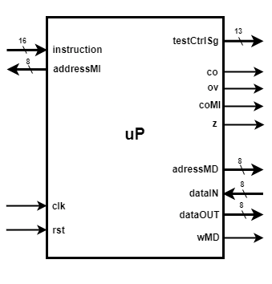
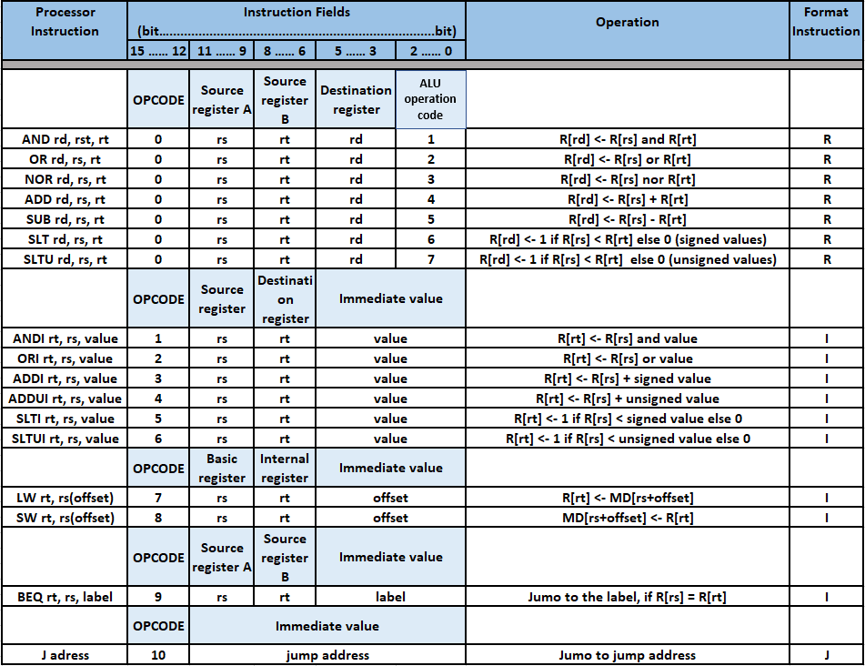
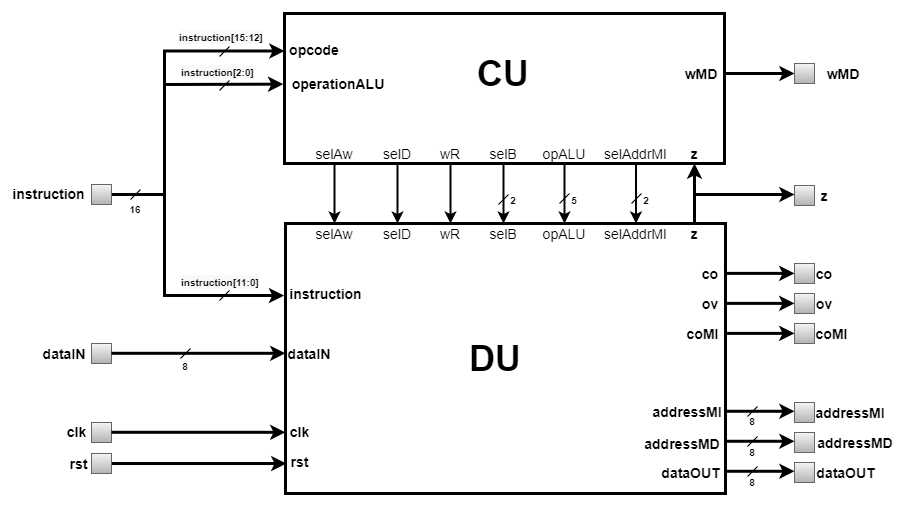

# 8-bit-MIPS-Processor  
---  
### Contents  

1. [Overview](#overview)  
2. [Introduction](#introduction)  
3. [The instruction set](#the-instruction-set)   
4. [Architecture](#architecture)
5. [Structure](#structure)
 
 
### Overview  

The main goal of this project is to create a **Verilog** implementation of **8 bit MIPS processor** based on the [**HARVARD architecture**](https://en.wikipedia.org/wiki/Harvard_architecture). 
The blocks that make up the processor are described mainly structurally, sometimes being described behaviorally or dataflow. For each major block, 
the architecture will be presented using schemes, the meaning of each port will also be described.  
  
This project is based on the Microprocessor Design course taught at the [Faculty of Electronics, Telecommunications and Information Technology of 
Iasi](https://etti.tuiasi.ro/). It was made as a result of a criterion to be able to graduate the course. The schemes, tables and information presented 
in this repository are taken from the laboratories related to the course mentioned above with slight modifications.  
  
	  
### Introduction

The processor is a [**Reduced Instruction Set Computer**](https://en.wikipedia.org/wiki/Reduced_instruction_set_computer) (RISC) type. In one 
cycle it can perform one of the 17 basic operations available. The instruction word is 16 bits, working in 3 different formats: R, I, J. The dimension of the data 
involved as an operand is 8 bits and is a signed or unsigned integer. As already specified, the processor is based on the Harvard architecture, which means that it works 
with 2 different blocks of memory with whom it communicates through 2 different buses. The processor can be seen in the figure below.  
<p align="center">
  
</p>
  
  	
### The instruction set

The table below shows all the **17 instructions** that the processor can perform. For each instruction, here is presented the instruction format, how the instruction 
word is formed and what operation is executed. 
<p align="center">
  
</p>

For some of the terms in the table, additional explanations are needed, such as:  
 * `OPCODE` = indicates the processor instruction, for R-format instructions the `ALU operating code` field is also required;  
 * `Source register` = the address of the internal register that provides the operand necessary for the execution of the instruction;  
 * `Destination register` = the address of the internal register where the result of the operation will be stored;  
 * `MD[addr]` = data from memory location at `addr` address;  
  
	
### Architecture
  
The processor is formed of 2 main blocks, [**Control Unit**](CU) (CU) and [**Data Unit**](DU) (DU), as it can be seen in the figure below. The role of CU is to generate the necessary 
control signals for DU. DU uses these signals to perform the desired elementary operation, specific to the execution of the current instruction. The role of these signals will 
be discussed later when these blocks will be presented.  
<p align="center">
  
</p>  

The processor pins and their meaning are as follows:  
* **Memory Instruction Bus**:    
	* `addressMI[7:0]` = output pin that provides the address of the next instruction;  
 	* `instrucion[15:0]` = input pin that receives the machine code of the current instruction;  
 * **Memory Data Bus**:  
 	* `addressMD[7:0]` = output pin that provides the required address of Data Memory Block to perfom read/write operation;   
 	* `dataIN[7:0]` = input pin that receives the data read from Data Memory Block as a result of using LW instruction;  
 	* `dataOUT[7:0]` = output pin that provides the data to be written to Data Memory Block as a result of using SW instruction;  
 	* `wMD` = output pin that provides the signal that controls the write operation in Data Memory Block;  
 * **Exception Signaling Outputs**:  
	* `co` = output pin that provides a signal that indicates an overflow in the representation of the result of an operation between unsigned integers;  
	* `ov` = output pin that provides a signal that indicates an overflow in the representation of the result of an operation between signed integers;  
	* `coMI` = output pin that provides a signal that indicates an overflow of the addressing capacity of Instruction Memory Block;  
	* `z` = output pin that provides a signal indicating a result equal to 0 at the output of Arithmetic-Logic Unit (ALU);  
 *  **Others**:  
	* `testCtrlSg[13:0]` = output pin that provides the control word of the current instruction to monitor the signal sent by the cu to DU.  
	* `clk` = input pin that receives the clock signal, the active front is the positive one;  
	* `rst` = input pin that receives the asynchronous initialization signal, which is active high;  
  
  
### Structure	
  
The processor has the following structure, which is based on how the processor is built:  
```
└──Processor Unit (uP)
   ├── Control Unit (CU)
   └── Data Unit (DU)
       ├── Address Calculation Block (ACB)
       └── Execution Block (EB)
           ├── Internal Registers File (IRF)
           └── Arithmetic-Logic Unit (ALU)
```
